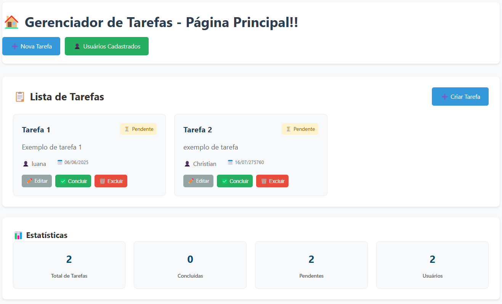
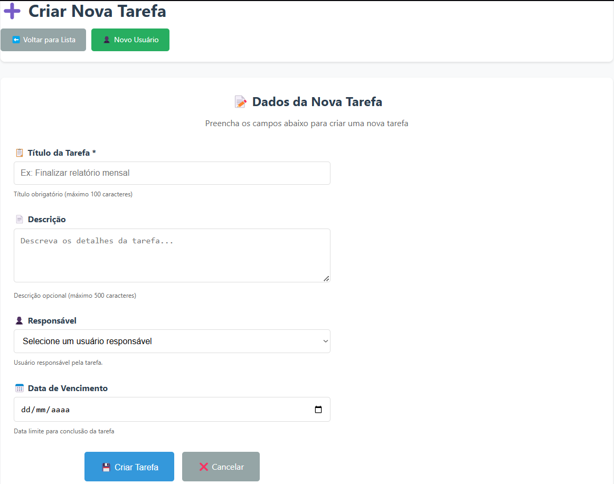
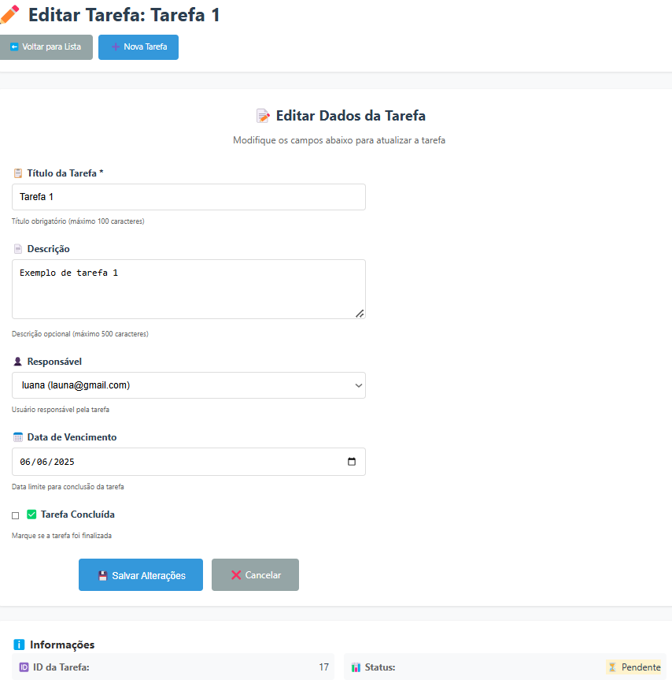
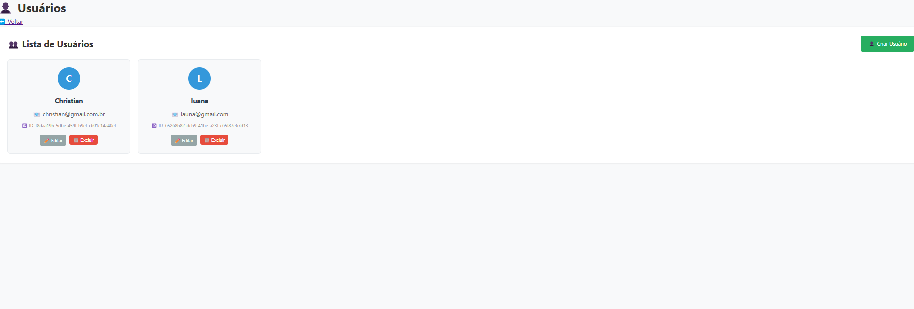
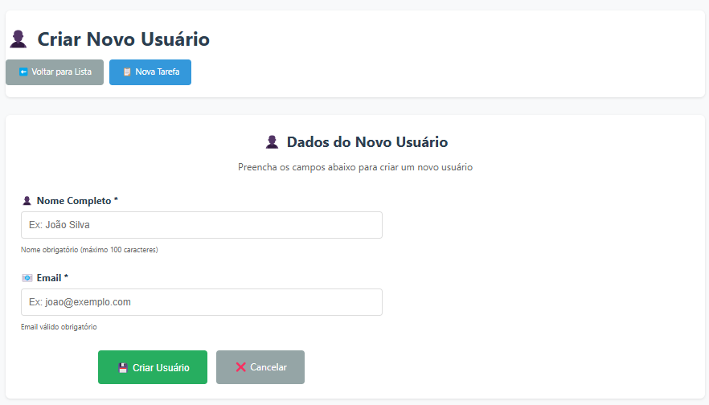

# Web Application Document - Projeto Individual - Módulo 2 - Inteli

## Nome do Projeto:

Sistema Gerenciador de Tarefas MVC

#### Autor do projeto:

Christian Vinícius Gandra dos Santos

## Sumário

1. [Introdução](#c1)
2. [Visão Geral da Aplicação Web](#c2)
3. [Projeto Técnico da Aplicação Web](#c3)
4. [Desenvolvimento da Aplicação Web](#c4)
5. [Referências](#c5)

<br>

## <a name="c1"></a>1. Introdução

O Sistema Gerenciador de Tarefas MVC é uma aplicação web completa desenvolvida para auxiliar usuários no controle e organização de suas atividades diárias. O sistema implementa um CRUD (Create, Read, Update, Delete) completo tanto para tarefas quanto para usuários, seguindo rigorosamente o padrão arquitetural MVC (Model-View-Controller).

### 1.1 Objetivos do Sistema

O sistema tem como objetivo principal proporcionar uma interface simples e intuitiva onde usuários podem:

- **Gerenciar Tarefas**: Criar, visualizar, editar, marcar como concluídas e excluir tarefas
- **Gerenciar Usuários**: Cadastrar, visualizar, editar e excluir usuários do sistema
- **Associar Responsáveis**: Vincular tarefas a usuários específicos para melhor organização
- **Acompanhar Progresso**: Visualizar o status das tarefas e seu progresso

### 1.2 Características Técnicas

O projeto foi desenvolvido com foco em:

- **Arquitetura MVC**: Separação clara entre Model, View e Controller
- **Tecnologias Modernas**: Node.js, Express, EJS, PostgreSQL
- **Interface Responsiva**: CSS customizado com design limpo e intuitivo
- **Validações Robustas**: Tanto no frontend quanto no backend
- **APIs RESTful**: Endpoints para integração e comunicação via fetch()
- **Segurança**: Validações de integridade referencial e tratamento de erros

### 1.3 Funcionalidades Implementadas

**Gestão de Tarefas:**

- ✅ Criar nova tarefa com título, descrição, data de vencimento e responsável
- ✅ Listar todas as tarefas com informações do responsável
- ✅ Editar tarefas existentes
- ✅ Marcar/desmarcar tarefas como concluídas
- ✅ Excluir tarefas com confirmação

**Gestão de Usuários:**

- ✅ Cadastrar novos usuários com nome e email
- ✅ Listar todos os usuários cadastrados
- ✅ Editar informações de usuários
- ✅ Excluir usuários (com verificação de dependências)
- ✅ Validação de email único

**Interface e Experiência:**

- ✅ Design responsivo e intuitivo
- ✅ Notificações de sucesso/erro
- ✅ Confirmações para ações destrutivas
- ✅ Loading states durante operações
- ✅ Navegação fluida entre páginas

---

## <a name="c2"></a>2. Visão Geral da Aplicação Web

### 2.1. Personas (Semana 01)

_(não se aplica)_

### 2.2. User Stories (Semana 01)

_(não se aplica)_

---

## <a name="c3"></a>3. Projeto da Aplicação Web

### 3.1. Modelagem do banco de dados

#### Modelo Relacional Implementado:

O sistema utiliza um modelo relacional simplificado e eficiente, composto por duas entidades principais que atendem perfeitamente aos requisitos do projeto:

<div align="center">
<sub>Figura 1 - Diagrama relacional do banco de dados implementado</sub>
 </img>
<sup>Fonte: Material produzido pelos autores (2025)</sup>
</div>

**Entidades Implementadas:**

**users:** Armazena informações dos usuários do sistema

- `id` (UUID): Identificador único gerado automaticamente
- `name` (VARCHAR(100)): Nome completo do usuário
- `email` (VARCHAR(100)): Email único para identificação

**tasks:** Representa as tarefas do sistema

- `id` (SERIAL): Identificador único auto-incrementado
- `title` (TEXT): Título da tarefa (obrigatório)
- `description` (TEXT): Descrição detalhada (opcional)
- `completed` (BOOLEAN): Status de conclusão (padrão: false)
- `due_date` (DATE): Data de vencimento (opcional)
- `user_id` (UUID): Referência ao usuário responsável (opcional)

**Relacionamentos:**

- Um usuário pode ter múltiplas tarefas (1:N entre users e tasks)
- Uma tarefa pode ter um usuário responsável ou ser independente
- Integridade referencial: ON DELETE SET NULL para manter tarefas mesmo se usuário for excluído

#### Modelo Físico (Schema SQL Atual):

O modelo físico implementado está no arquivo `scripts/init.sql`:

```sql
-- Extensão para UUID
CREATE EXTENSION IF NOT EXISTS "uuid-ossp";

-- Tabela de usuários
CREATE TABLE IF NOT EXISTS users (
  id UUID PRIMARY KEY DEFAULT uuid_generate_v4(),
  name VARCHAR(100) NOT NULL,
  email VARCHAR(100) UNIQUE NOT NULL
);

-- Tabela de tarefas
CREATE TABLE IF NOT EXISTS tasks (
  id SERIAL PRIMARY KEY,
  title TEXT NOT NULL,
  description TEXT,
  completed BOOLEAN DEFAULT false,
  due_date DATE,
  user_id UUID,
  CONSTRAINT fk_user FOREIGN KEY (user_id) REFERENCES users(id) ON DELETE SET NULL
);
```

**Características do Modelo:**

- ✅ **Simplicidade**: Duas tabelas essenciais que atendem todos os requisitos
- ✅ **Flexibilidade**: Tarefas podem existir com ou sem usuário responsável
- ✅ **Integridade**: Chaves estrangeiras com comportamento adequado
- ✅ **Escalabilidade**: Estrutura permite futuras expansões
- ✅ **Performance**: Índices automáticos em chaves primárias e únicas

### 3.1.1 BD e Models (Semana 5)

O sistema web desenvolvido utiliza o PostgreSQL como banco de dados relacional, estruturado em duas tabelas principais: users e tasks. Essas tabelas são responsáveis por armazenar os dados dos usuários e das tarefas do sistema, respectivamente. A estrutura foi criada manualmente utilizando comandos SQL, sem o uso de ORMs, garantindo controle direto sobre o esquema do banco.

A tabela users armazena informações dos usuários responsáveis pelas tarefas. Cada usuário possui um identificador único gerado automaticamente (id do tipo UUID), além de campos obrigatórios como name (nome completo) e email (endereço de e-mail único). Essa tabela serve como referência para associar um responsável a cada tarefa cadastrada.

A tabela tasks, por sua vez, é responsável por armazenar as tarefas do sistema. Cada tarefa possui um identificador (id do tipo serial), um title (título da tarefa), uma description (descrição opcional), um campo booleano completed que indica se a tarefa está concluída, e um campo due_date (do tipo DATE), que representa a data de vencimento da tarefa. Além disso, existe o campo user_id, que é uma chave estrangeira opcional referenciando a tabela users. Caso o campo user_id não seja preenchido, a tarefa será considerada sem um responsável atribuído.

No código, essas interações com o banco são feitas por meio de arquivos de Model, localizados na pasta models/. Esses arquivos implementam funções assíncronas que executam comandos SQL utilizando o pacote pg. Entre os principais métodos definidos no taskModel.js, estão:

**create(data)**: Insere uma nova tarefa no banco, com ou sem usuário responsável.

**findAll()**: Retorna todas as tarefas cadastradas, incluindo o nome do usuário associado (quando houver).

**findByUser(user_id)**: Filtra as tarefas de um determinado usuário.

**update(id, data)**: Atualiza os dados de uma tarefa existente, incluindo status de conclusão e data de vencimento.

**delete(id)**: Exclui uma tarefa com base no seu ID.

A camada de Models, portanto, representa a base de dados da aplicação, sendo responsável por realizar as operações de leitura, escrita e atualização de forma segura e controlada. Essa arquitetura garante uma separação clara entre a lógica de acesso aos dados e as demais camadas da aplicação, facilitando a manutenção e a escalabilidade do sistema.

### 3.2. Arquitetura (Semana 5)

O diagrama abaixo representa a arquitetura MVC (Model-View-Controller) do sistema de gerenciamento de tarefas.

<div align="center">
<sub>Figura 2 - Diagrama da arquitetura MVC</sub>
 </img>
<sup>Fonte: Material produzido pelos autores (2025)</sup>
</div>
A camada Model define a estrutura dos dados e interage com o banco de dados PostgreSQL, incluindo as tabelas users (com campos como id, name e email) e tasks (com id, title, description, due_date e user_id). A camada Controller centraliza a lógica de negócio por meio dos arquivos taskController.js e userController.js, que recebem as requisições da interface, processam os dados e interagem com o Model. A camada View representa a interface do usuário, exibindo formulários e listas de tarefas, permitindo ações como criar ou editar. O fluxo ocorre da View para o Controller, que consulta ou atualiza o Model, retornando os dados para a View. Esse padrão organiza a aplicação de forma modular e facilita a manutenção.

### 3.3. Wireframes (Semana 03)

_(não se aplica)_

### 3.4. Guia de estilos (Semana 05)

_(não se aplica)_

### 3.5. Protótipo de alta fidelidade (Semana 05)

_(não se aplica)_

### 3.6. WebAPI e endpoints

A aplicação foi estruturada com uma WebAPI completa em Node.js utilizando o framework Express, seguindo os princípios da arquitetura REST. O sistema implementa dois tipos de rotas: **rotas para views** (renderização EJS) e **rotas de API** (retorno JSON), proporcionando flexibilidade total para diferentes tipos de consumo.

#### 3.6.1 Estrutura de Rotas

**Rotas para Views (Renderização EJS):**

- Utilizadas para navegação web tradicional
- Retornam páginas HTML renderizadas com EJS
- Processam formulários via POST

**Rotas de API (JSON):**

- Utilizadas para comunicação via fetch() JavaScript
- Retornam dados em formato JSON
- Seguem padrões RESTful

#### 3.6.2 Endpoints de Tarefas

**Views (Páginas Web):**

- `GET /tasks` → Lista de tarefas (página principal)
- `GET /tasks/new` → Formulário para nova tarefa
- `GET /tasks/edit/:id` → Formulário para editar tarefa
- `POST /tasks` → Criar nova tarefa
- `POST /tasks/edit/:id` → Atualizar tarefa
- `POST /tasks/toggle/:id` → Alternar status (concluída/pendente)
- `POST /tasks/delete/:id` → Excluir tarefa

**API (JSON):**

- `GET /api/tasks/api` → Listar todas as tarefas (JSON)
- `GET /api/tasks/api/:id` → Buscar tarefa por ID (JSON)
- `POST /api/tasks/api` → Criar nova tarefa (JSON)
- `PUT /api/tasks/api/:id` → Atualizar tarefa (JSON)
- `DELETE /api/tasks/api/:id` → Excluir tarefa (JSON)

#### 3.6.3 Endpoints de Usuários

**Views (Páginas Web):**

- `GET /users` → Lista de usuários
- `GET /users/new` → Formulário para novo usuário
- `GET /users/edit/:id` → Formulário para editar usuário
- `POST /users` → Criar novo usuário
- `POST /users/edit/:id` → Atualizar usuário
- `POST /users/delete/:id` → Excluir usuário

**API (JSON):**

- `GET /api/users/api` → Listar todos os usuários (JSON)
- `GET /api/users/api/:id` → Buscar usuário por ID (JSON)
- `POST /api/users/api` → Criar novo usuário (JSON)
- `PUT /api/users/api/:id` → Atualizar usuário (JSON)
- `DELETE /api/users/api/:id` → Excluir usuário (JSON)

#### 3.6.4 Características Técnicas

**Validações Implementadas:**

- ✅ Verificação de campos obrigatórios
- ✅ Validação de email único
- ✅ Verificação de integridade referencial
- ✅ Sanitização de dados de entrada

**Tratamento de Erros:**

- ✅ Códigos HTTP apropriados (200, 201, 400, 404, 500)
- ✅ Mensagens de erro descritivas
- ✅ Logs detalhados para debugging

**Segurança:**

- ✅ Validação de parâmetros
- ✅ Prevenção de SQL injection via prepared statements
- ✅ Verificação de dependências antes de exclusões

### 3.7 Interface e Navegação

O sistema foi desenvolvido com uma interface web moderna e responsiva, utilizando EJS como template engine, CSS customizado e JavaScript para interatividade. A navegação segue padrões intuitivos e oferece feedback visual completo para todas as operações.

#### 3.7.1 Tecnologias Frontend

**Template Engine:**

- ✅ **EJS (Embedded JavaScript)** → Renderização dinâmica de páginas
- ✅ **Partials e Layouts** → Reutilização de componentes
- ✅ **Dados dinâmicos** → Integração com backend via controllers

**Estilização:**

- ✅ **CSS Customizado** → Arquivo `/public/css/style.css` completo
- ✅ **Design Responsivo** → Adaptação para diferentes dispositivos
- ✅ **Sistema de cores** → Paleta consistente e acessível
- ✅ **Componentes reutilizáveis** → Botões, cards, formulários padronizados

**Interatividade:**

- ✅ **JavaScript Vanilla** → Sem dependências externas
- ✅ **Fetch API** → Comunicação assíncrona com backend
- ✅ **Validações em tempo real** → Feedback imediato ao usuário
- ✅ **Confirmações inteligentes** → Prevenção de ações acidentais

#### 3.7.2 Páginas Implementadas

<div align="center">
<sub>Figura 3 - Página inicial do sistema</sub>
 </img>
<sup>Fonte: Material produzido pelos autores (2025)</sup>
</div>

**Página Principal (`/tasks`):**

- Lista completa de tarefas com informações do responsável
- Botões para criar, editar, marcar como concluída e excluir
- Seção de usuários com ações de gerenciamento
- Notificações de sucesso/erro
- Design em cards responsivos

<div align="center">
<sub>Figura 4 - Página de criação de nova tarefa</sub>
 </img>
<sup>Fonte: Material produzido pelos autores (2025)</sup>
</div>

**Formulário de Nova Tarefa (`/tasks/new`):**

- Campos: título, descrição, data de vencimento, responsável
- Validações em tempo real
- Dropdown com usuários cadastrados
- Botões de salvar e cancelar

<div align="center">
<sub>Figura 5 - Página de edição de tarefa</sub>
 </img>
<sup>Fonte: Material produzido pelos autores (2025)</sup>
</div>

**Formulário de Edição (`/tasks/edit/:id` e `/users/edit/:id`):**

- Campos pré-preenchidos com dados atuais
- Validações específicas para cada tipo
- Informações contextuais sobre o item sendo editado
- Navegação clara de volta para lista

<div align="center">
<sub>Figura 6 - Página de exibição de usuários cadastrados</sub>
 </img>
<sup>Fonte: Material produzido pelos autores (2025)</sup>
</div>

**Lista de Usuários (`/users`):**

- Cards com informações de cada usuário
- Ações de editar e excluir
- Notificações de operações realizadas

<div align="center">
<sub>Figura 7 - Página de criação de novo usuário</sub>
 </img>
<sup>Fonte: Material produzido pelos autores (2025)</sup>
</div>


**Formulário de Novo Usuário (`/users/new`):**

- Campos: nome e email
- Validação de email único
- Feedback visual para campos obrigatórios

#### 3.7.3 Componentes de Interface

**Sistema de Notificações por pop-up:**

- ✅ **Mensagens automáticas** → Aparecem após operações
- ✅ **Auto-remoção** → Desaparecem após 5 segundos
- ✅ **Botão de fechar** → Controle manual pelo usuário
- ✅ **Cores contextuais** → Verde (sucesso), vermelho (erro), amarelo (aviso)

**Confirmações de Ações:**

- ✅ **Exclusão de tarefas** → Popup com nome da tarefa
- ✅ **Exclusão de usuários** → Verificação de dependências
- ✅ **Loading states** → Botões mostram "Processando..." durante operações

**Formulários Inteligentes:**

- ✅ **Validação em tempo real** → Feedback imediato
- ✅ **Campos obrigatórios** → Destaque visual
- ✅ **Contadores de caracteres** → Para campos com limite
- ✅ **Formatação automática** → Datas e emails

#### 3.7.4 Navegação e Fluxo

**Fluxo Principal:**

```
Página Inicial → Lista de Tarefas e Usuários
     ↓
Criar/Editar → Formulários específicos
     ↓
Confirmação → Notificação de sucesso
     ↓
Retorno → Lista atualizada
```

**Navegação Intuitiva:**

- ✅ **Breadcrumbs visuais** → Usuário sempre sabe onde está
- ✅ **Botões contextuais** → Ações relevantes sempre visíveis
- ✅ **Links de retorno** → Fácil navegação entre páginas
- ✅ **Estados visuais** → Hover, active, disabled bem definidos

#### 3.7.5 Responsividade

**Breakpoints Implementados:**

- ✅ **Desktop** → Layout completo com sidebar
- ✅ **Tablet** → Adaptação de grid e espaçamentos
- ✅ **Mobile** → Layout vertical, botões maiores

**Adaptações Mobile:**

- ✅ **Menu responsivo** → Navegação otimizada para touch
- ✅ **Formulários adaptados** → Campos maiores, melhor usabilidade
- ✅ **Cards empilhados** → Layout vertical em telas pequenas

---

## <a name="c4"></a>4. Desenvolvimento da Aplicação Web

### 4.1 Sistema Implementado

O Sistema Gerenciador de Tarefas MVC foi desenvolvido como uma aplicação web completa, implementando todas as funcionalidades planejadas e seguindo rigorosamente o padrão arquitetural MVC. O sistema oferece uma solução robusta para gerenciamento de tarefas e usuários.

#### 4.1.1 Funcionalidades Entregues

**Gestão Completa de Tarefas:**

- ✅ **CRUD Completo** → Criar, listar, editar e excluir tarefas
- ✅ **Status de Conclusão** → Marcar/desmarcar como concluída
- ✅ **Associação de Responsáveis** → Vincular tarefas a usuários
- ✅ **Datas de Vencimento** → Controle temporal das atividades
- ✅ **Validações Robustas** → Campos obrigatórios e limites de caracteres

**Gestão Completa de Usuários:**

- ✅ **CRUD Completo** → Criar, listar, editar e excluir usuários
- ✅ **Email Único** → Validação de unicidade
- ✅ **Integridade Referencial** → Proteção contra exclusões inválidas
- ✅ **Validações de Formulário** → Nome e email obrigatórios

**Interface e Experiência:**

- ✅ **Design Responsivo** → Funciona em desktop, tablet e mobile
- ✅ **Notificações Inteligentes** → Feedback visual para todas as operações
- ✅ **Confirmações de Segurança** → Prevenção de ações acidentais
- ✅ **Loading States** → Feedback durante processamento

#### 4.1.2 Tecnologias Utilizadas

**Backend:**

- ✅ **Node.js** → Runtime JavaScript
- ✅ **Express.js** → Framework web
- ✅ **PostgreSQL** → Banco de dados relacional
- ✅ **pg** → Driver PostgreSQL para Node.js

**Frontend:**

- ✅ **EJS** → Template engine
- ✅ **CSS Customizado** → Estilização responsiva
- ✅ **JavaScript Vanilla** → Interatividade sem dependências
- ✅ **Fetch API** → Comunicação assíncrona

**Arquitetura:**

- ✅ **MVC Pattern** → Separação clara de responsabilidades
- ✅ **RESTful APIs** → Endpoints padronizados
- ✅ **SQL Nativo** → Controle direto sobre queries

#### 4.1.3 Estrutura do Projeto

```
mvc-boilerplate/
├── app.js                 # Servidor principal
├── config/
│   └── db.js             # Configuração do banco
├── controllers/
│   ├── taskController.js # Lógica de tarefas
│   └── userController.js # Lógica de usuários
├── models/
│   ├── task.js          # Modelo de tarefas
│   └── user.js          # Modelo de usuários
├── routes/
│   ├── tasks.js         # Rotas de tarefas
│   └── users.js         # Rotas de usuários
├── views/
│   ├── tasks/           # Views de tarefas
│   ├── users/           # Views de usuários
│   └── editar.ejs       # Formulário de edição
├── public/
│   ├── css/style.css    # Estilos customizados
│   └── js/app.js        # JavaScript frontend
└── scripts/
    └── init.sql         # Script de inicialização do BD
```

### 4.2 Conclusões e Trabalhos Futuros

O Sistema Gerenciador de Tarefas MVC atingiu seus objetivos de projeto, demonstrando a capacidade de construir uma aplicação web robusta, organizada e funcional com base no padrão MVC. Esta seção sintetiza os pontos fortes alcançados, identifica áreas para aprimoramento e delineia planos para o futuro do desenvolvimento.

### Desafios Enfrentados:
O desenvolvimento do Sistema Gerenciador de Tarefas MVC, embora com objetivos claros de implementação CRUD, apresentou um desafio técnico primordial e central: a integração eficaz e harmoniosa entre a camada de apresentação (views) e as operações de manipulação de dados (CRUD). Este ponto foi a pedra angular para a funcionalidade do sistema, exigindo um entendimento aprofundado do fluxo de dados em uma arquitetura MVC.

A complexidade residiu em garantir que cada ação do usuário na interface (seja preencher um formulário, clicar em um botão de edição ou exclusão) fosse traduzida de forma precisa e segura em operações de banco de dados, e que as informações atualizadas fossem refletidas dinamicamente de volta para a tela. Isso demandou a superação de aspectos como:

**Orquestração de Fluxo:** Desenvolver uma lógica de controle robusta nos controllers que pudesse receber requisições das views, interagir com os models para processar os dados e, em seguida, retornar a resposta correta para a camada de apresentação, seja via renderização de novas páginas EJS ou através de respostas JSON para atualizações assíncronas via fetch().

**Consistência de Dados:** Assegurar que os dados trafegando entre o frontend e o backend estivessem sempre consistentes e validados. Isso implicou na implementação de validações em ambas as camadas (frontend para feedback imediato e backend para segurança e integridade) e na gestão de mensagens de sucesso ou erro que informassem o usuário de forma clara.
Manuseio de Estado da Aplicação: Gerenciar como o estado da aplicação era modificado após cada operação CRUD e como essa mudança era propagada para a interface, garantindo que a lista de tarefas ou usuários estivesse sempre atualizada, mesmo em interações assíncronas que evitavam o recarregamento total da página.

A superação desses pontos não foi apenas um exercício técnico, mas uma validação da eficácia do padrão MVC como um arcabouço para desenvolver aplicações web modulares e escaláveis. A capacidade de dividir o problema em componentes menores e interconectados — models para dados, views para UI e controllers para a lógica de negócio e fluxo — foi fundamental para construir um sistema coeso e funcional, demonstrando a habilidade em transformar requisitos em soluções arquiteturais concretas.

### Aprendizados Obtidos
A superação dos desafios de integração e a construção da aplicação resultaram em aprendizados fundamentais que fortaleceram as habilidades técnicas e metodológicas:

#### Técnicos:

✅ **Domínio do Padrão MVC:** Aprofundamento prático na aplicação e nos benefícios do padrão MVC, entendendo como cada camada contribui para a organização, manutenibilidade e escalabilidade do software.

✅ **Comunicação Frontend-Backend:** Experiência consolidada na orquestração da comunicação entre o lado do cliente (EJS, JavaScript Vanilla, Fetch API) e o lado do servidor (Node.js, Express), incluindo o gerenciamento de requisições, respostas e tratamento de dados.

#### Metodológicos:

✅ **Abordagem Iterativa:** Compreensão do valor de desenvolver e testar as funcionalidades CRUD em etapas incrementais, permitindo a identificação e correção de problemas de integração precocemente.

✅ **Foco na Experiência do Usuário (UX):** A percepção de que mesmo em funcionalidades básicas, o feedback visual e a prevenção de erros são cruciais para a aceitação e usabilidade do sistema.

---
