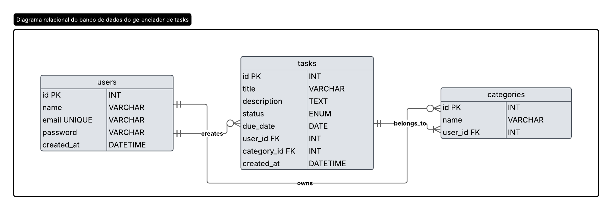
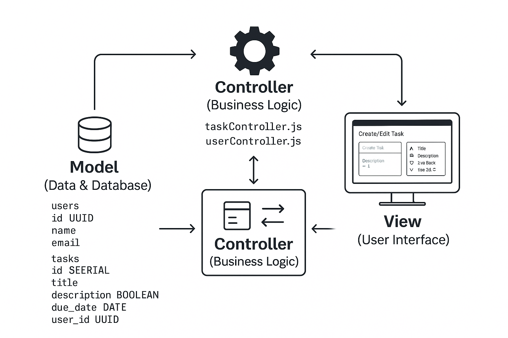

# Web Application Document - Projeto Individual - Módulo 2 - Inteli

## Nome do Projeto:
Sistema Gerenciador de Tasks

#### Autor do projeto:
Christian Vinícius Gandra dos Santos

## Sumário

1. [Introdução](#c1)  
2. [Visão Geral da Aplicação Web](#c2)  
3. [Projeto Técnico da Aplicação Web](#c3)  
4. [Desenvolvimento da Aplicação Web](#c4)  
5. [Referências](#c5)  

<br>

## <a name="c1"></a>1. Introdução (Semana 01)
O sistema desenvolvido será um Gerenciador de Tarefas web, que tem como objetivo auxiliar usuários no controle e organização de suas atividades diárias. Com uma interface simples e intuitiva, o sistema permitirá que usuários possam cadastrar, visualizar, atualizar e excluir tarefas de forma eficiente.

Cada tarefa possuirá atributos como título, descrição, status (pendente, em andamento, concluída) e data de vencimento. A proposta é proporcionar um ambiente onde o usuário possa acompanhar o progresso de suas atividades, priorizar demandas e manter uma rotina mais produtiva.

O sistema será implementado utilizando a arquitetura MVC (Model-View-Controller), com Node.js no backend, JavaScript e HTML/CSS no frontend, e banco de dados relacional para armazenar as informações. As tecnologias escolhidas visam garantir organização do código, manutenibilidade e escalabilidade da aplicação.

Além das funcionalidades básicas de CRUD (Create, Read, Update, Delete), o projeto será estruturado de forma modular, com foco em boas práticas de desenvolvimento e testes automatizados. O sistema também contará com documentação de apoio, scripts para inicialização do banco de dados e testes de requisições HTTP para facilitar o uso e entendimento.

Com isso, o Gerenciador de Tarefas propõe-se não apenas como uma ferramenta funcional para organização pessoal, mas também como um exercício completo de desenvolvimento web, integrando conceitos teóricos à prática. O projeto será uma base sólida para evoluções futuras, permitindo a adição de novas funcionalidades conforme o amadurecimento técnico do time de desenvolvimento.

---

## <a name="c2"></a>2. Visão Geral da Aplicação Web

### 2.1. Personas (Semana 01)

*(não se aplica)*

### 2.2. User Stories (Semana 01)

*(não se aplica)*


---

## <a name="c3"></a>3. Projeto da Aplicação Web

### 3.1. Modelagem do banco de dados  (Semana 3)

#### Modelo Relacional:

A seguir está representado o diagrama relacional do banco de dados desenvolvido para o sistema de Gerenciador de Tarefas:

<div align="center">
<sub>Figura 1 - Diagrama relacional do banco de dados</sub>
 </img>
<sup>Fonte: Material produzido pelos autores (2025)</sup>
</div>

**Esse modelo contempla três entidades principais:**

**users:** armazena informações dos usuários, como nome, e-mail e senha.

**tasks:** representa as tarefas criadas pelos usuários, incluindo título, descrição, status, data de vencimento, e referência ao usuário e categoria.

**categories:** organiza as tarefas em categorias definidas pelo próprio usuário.

As principais relações entre essas entidades são:

Um usuário pode criar múltiplas tarefas (1:N entre users e tasks).

Cada tarefa pode pertencer a uma categoria (N:1 entre tasks e categories).

Uma categoria é associada a um usuário específico (1:N entre users e categories).

#### Modelo Físico (Schema SQL):
O modelo físico do banco de dados está implementado no arquivo modelo.sql, que contém os comandos de criação das tabelas com suas chaves primárias e estrangeiras, tipos de dados, restrições e estrutura geral do banco. Contudo, abaixo está representado o código de criação das tabelas do banco de dados

```sql
CREATE TYPE task_status AS ENUM ('pending', 'in_progress', 'done');

CREATE TABLE users (
    id SERIAL PRIMARY KEY,
    name VARCHAR(100) NOT NULL,
    email VARCHAR(100) UNIQUE NOT NULL,
    password VARCHAR(255) NOT NULL,
    created_at TIMESTAMP DEFAULT CURRENT_TIMESTAMP
);

CREATE TABLE categories (
    id SERIAL PRIMARY KEY,
    name VARCHAR(100) NOT NULL,
    user_id INT,
    FOREIGN KEY (user_id) REFERENCES users(id) ON DELETE CASCADE
);

CREATE TABLE tasks (
    id SERIAL PRIMARY KEY,
    title VARCHAR(150) NOT NULL,
    description TEXT,
    status task_status DEFAULT 'pending',
    due_date DATE,
    user_id INT,
    category_id INT,
    created_at TIMESTAMP DEFAULT CURRENT_TIMESTAMP,
    FOREIGN KEY (user_id) REFERENCES users(id) ON DELETE CASCADE,
    FOREIGN KEY (category_id) REFERENCES categories(id) ON DELETE SET NULL
);
```
Essa estrutura proporciona uma base sólida e bem normalizada para o funcionamento do sistema, assegurando a integridade dos dados e a escalabilidade do banco. Com as relações bem definidas entre usuários, tarefas e categorias, o modelo permite consultas eficientes e facilita futuras manutenções ou expansões no sistema.

### 3.1.1 BD e Models (Semana 5)
O sistema web desenvolvido utiliza o PostgreSQL como banco de dados relacional, estruturado em duas tabelas principais: users e tasks. Essas tabelas são responsáveis por armazenar os dados dos usuários e das tarefas do sistema, respectivamente. A estrutura foi criada manualmente utilizando comandos SQL, sem o uso de ORMs, garantindo controle direto sobre o esquema do banco.

A tabela users armazena informações dos usuários responsáveis pelas tarefas. Cada usuário possui um identificador único gerado automaticamente (id do tipo UUID), além de campos obrigatórios como name (nome completo) e email (endereço de e-mail único). Essa tabela serve como referência para associar um responsável a cada tarefa cadastrada.

A tabela tasks, por sua vez, é responsável por armazenar as tarefas do sistema. Cada tarefa possui um identificador (id do tipo serial), um title (título da tarefa), uma description (descrição opcional), um campo booleano completed que indica se a tarefa está concluída, e um campo due_date (do tipo DATE), que representa a data de vencimento da tarefa. Além disso, existe o campo user_id, que é uma chave estrangeira opcional referenciando a tabela users. Caso o campo user_id não seja preenchido, a tarefa será considerada sem um responsável atribuído.

No código, essas interações com o banco são feitas por meio de arquivos de Model, localizados na pasta models/. Esses arquivos implementam funções assíncronas que executam comandos SQL utilizando o pacote pg. Entre os principais métodos definidos no taskModel.js, estão:

**create(data)**: Insere uma nova tarefa no banco, com ou sem usuário responsável.

**findAll()**: Retorna todas as tarefas cadastradas, incluindo o nome do usuário associado (quando houver).

**findByUser(user_id)**: Filtra as tarefas de um determinado usuário.

**update(id, data)**: Atualiza os dados de uma tarefa existente, incluindo status de conclusão e data de vencimento.

**delete(id)**: Exclui uma tarefa com base no seu ID.

A camada de Models, portanto, representa a base de dados da aplicação, sendo responsável por realizar as operações de leitura, escrita e atualização de forma segura e controlada. Essa arquitetura garante uma separação clara entre a lógica de acesso aos dados e as demais camadas da aplicação, facilitando a manutenção e a escalabilidade do sistema.

### 3.2. Arquitetura (Semana 5)

O diagrama abaixo representa a arquitetura MVC (Model-View-Controller) do sistema de gerenciamento de tarefas. 
<div align="center">
<sub>Figura 2 - Diagrama da arquitetura MVC</sub>
 </img>
<sup>Fonte: Material produzido pelos autores (2025)</sup>
</div>
A camada Model define a estrutura dos dados e interage com o banco de dados PostgreSQL, incluindo as tabelas users (com campos como id, name e email) e tasks (com id, title, description, due_date e user_id). A camada Controller centraliza a lógica de negócio por meio dos arquivos taskController.js e userController.js, que recebem as requisições da interface, processam os dados e interagem com o Model. A camada View representa a interface do usuário, exibindo formulários e listas de tarefas, permitindo ações como criar ou editar. O fluxo ocorre da View para o Controller, que consulta ou atualiza o Model, retornando os dados para a View. Esse padrão organiza a aplicação de forma modular e facilita a manutenção.

### 3.3. Wireframes (Semana 03)

*(não se aplica)*

### 3.4. Guia de estilos (Semana 05)

*(não se aplica)*

### 3.5. Protótipo de alta fidelidade (Semana 05)

*(não se aplica)*

### 3.6. WebAPI e endpoints (Semana 05)

A aplicação foi estruturada com uma WebAPI em Node.js utilizando o framework Express, seguindo os princípios da arquitetura REST. Os endpoints foram organizados de forma a atender às operações CRUD básicas tanto para usuários quanto para tarefas, respeitando a separação de responsabilidades proposta pela arquitetura MVC.

Para o recurso usuários, foi implementado o endpoint POST /users, que permite a criação de um novo usuário a partir do envio dos campos name e email. Além disso, o endpoint GET /users/:id/tasks permite listar todas as tarefas associadas a um usuário específico, com base no id fornecido na URL.

Para o recurso tarefas, foram implementados os seguintes endpoints:

GET /tasks: recupera a lista completa de tarefas cadastradas no sistema, incluindo informações como título, descrição, status de conclusão, data de vencimento (due_date) e o nome do usuário responsável (caso exista).

POST /tasks: permite a criação de uma nova tarefa com os campos title, description, due_date (data no formato ISO) e user_id (opcional, para vincular a tarefa a um usuário existente).

POST /tasks/edit/:id: atualiza uma tarefa existente, identificada pelo seu id, com novos valores para title, description, due_date e completed.

POST /tasks/delete/:id: remove uma tarefa com base em seu id.

Esses endpoints são acessados por meio de formulários HTML (View), e processados pelos controllers, que por sua vez se comunicam diretamente com os Models (consultas SQL sem ORM). O fluxo segue o padrão MVC, com cada camada desempenhando sua função específica: a View envia os dados via formulário, o Controller os trata e os encaminha para o Model, que executa a ação no banco de dados e retorna os resultados.

### 3.7 Interface e Navegação (Semana 07)

*Descreva e ilustre aqui o desenvolvimento do frontend do sistema web, explicando brevemente o que foi entregue em termos de código e sistema. Utilize prints de tela para ilustrar.*

---

## <a name="c4"></a>4. Desenvolvimento da Aplicação Web (Semana 8)

### 4.1 Demonstração do Sistema Web (Semana 8)

*VIDEO: Insira o link do vídeo demonstrativo nesta seção*
*Descreva e ilustre aqui o desenvolvimento do sistema web completo, explicando brevemente o que foi entregue em termos de código e sistema. Utilize prints de tela para ilustrar.*

### 4.2 Conclusões e Trabalhos Futuros (Semana 8)

*Indique pontos fortes e pontos a melhorar de maneira geral.*
*Relacione também quaisquer outras ideias que você tenha para melhorias futuras.*


## <a name="c5"></a>5. Referências

_Incluir as principais referências de seu projeto, para que seu parceiro possa consultar caso ele se interessar em aprofundar. Um exemplo de referência de livro e de site:_<br>

---
---